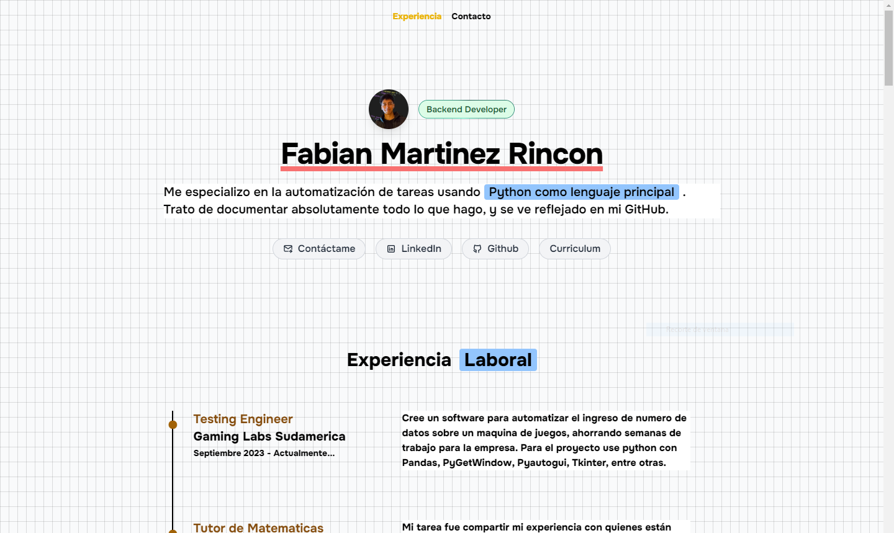

### 🐥 Primero Licenciatura en Sistemas

<a href="https://github.com/Fabian-Martinez-Rincon/Arquitectura-de-Computadoras">
<a href="https://github.com/Fabian-Martinez-Rincon/Efficiency_X">
<a href="https://github.com/Fabian-Martinez-Rincon/Organizacion_de_Computadoras">
<a href="https://github.com/Fabian-Martinez-Rincon/Fabian-Martinez-Rincon.github.io">

### 🐔 Segundo Licenciatura en Sistemas

### 🦅 Tercero Licenciatura en Sistemas

