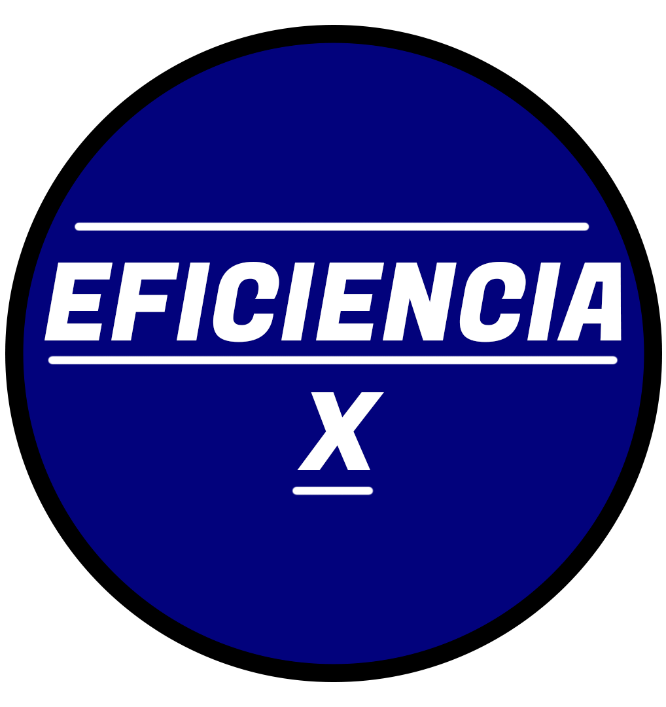

<h1 align="center"> Hi there, I'm <a href="https://fabian-martinez1.github.io/" target="_blank">Fabian Martinez</a>
 </h1>


<table align="right">
<tr>
<td>  <div align="center">Mega Conversor OC</div> </td> <td> <div align="center" >Zona Fabo</div> </td>
</tr>

 <tr>
<td> <a href="https://fabian-martinez1.github.io/Mega-Conversor-OC/"></a> </td> <td><a href="https://zonafabo.github.io/"></a> </td>
</tr>
 
</table>

### 🤖```Yop``` 
Hola, mi nombre es Fabián, soy técnico electrónico y actualmente estudio licenciatura en informática (UNLP Argentina). Mis intereses actuales se centran en el desarrollo de web y el machine learning. Aquí está mi [resume](https://fabian-martinez1.github.io/Resume/) completo y puedes contactarme enviando un correo electrónico a [mail](fabianmartinezrincon.123@gmail.com).


---


### 📌Proyectos


<!--START_SECTION:top-followers-->
<table>
  <tr>
    <td align="center">
  <a href="https://zonafabo.github.io/">
    <br />ZonaFabo</a>
    </td>
    <td align="center">
    <a href="https://mith-arg.github.io/EI-Materias-Web/"><br />EIMaterias</a>
    </td>
    <td align="center">
<a href="https://fabian-martinez1.github.io/Mega-Conversor-OC/"><br />MEGA CONVER</a>
    </td>
    <td align="center">
      <a href="https://fabian-martinez1.github.io/"><br />Portfolio</a>
    </td>
    <td align="center">
  <a href="https://fabian-martinez1.github.io/Converter-OC/"><br />Converter OC</a>
    </td>
    <td align="center">
<a href="https://fabian-martinez1.github.io/Keypad/"><br />KEYPAD</a>
    <td align="center">
<a href="https://fabian-martinez1.github.io/Lock/"><br />LOCK</a>
    </td>
  </tr>
    <tr>
    <td align="center">
<a href="https://fabian-martinez1.github.io/Efficiency_X/"><br />Eficiencia X</a>
    </td>
    <td align="center">
<a href="https://fabian-martinez1.github.io/Resume/"><br />Resume</a>
    </td>
    <td align="center">
<a href="https://fabian-martinez1.github.io/Quien-quiere-ser-aprobado/"><br />APROBADO</a>
    </td>
    <td align="center">
<a href="https://fabian-martinez1.github.io/Old_Portfolio/"><br />OLD</a>
    </td>
    <td align="center">
<a href="https://fabian-martinez1.github.io/Transform-Pokemon-Resolution/"><br />Transform Resolution</a>
    </td>

  </tr>


</table>
<!--END_SECTION:top-followers-->


<details> <summary>📈 Stats</summary>

 <br>
 
 <a align="center" href="https://github.com/Fabian-Fartinez1/github-readme-stats"></a>
  <a align="center" href="https://github.com/Fabian-Fartinez1/github-readme-stats"></a>

</details>

<details><summary>📘 Materias</summary>

 <br>
 
   <a href="https://github.com/Fabian-Martinez1/FOD"></a>
  <a href="https://github.com/Fabian-Martinez1/AyED"></a>
  <a href="https://github.com/Fabian-Martinez1/Seminario-de-Lenguajes-Python"></a>
  <a href="https://github.com/Fabian-Martinez1/EPA"></a>
  <a href="https://github.com/Fabian-Martinez1/CADP"></a>
  <a href="https://github.com/Fabian-Martinez1/Taller-de-Programacion"></a>
  <a href="https://github.com/Fabian-Martinez1/OC"></a>
  <a href="https://github.com/Fabian-Martinez1/Arquitectura-de-Computadoras"></a>

</details>


