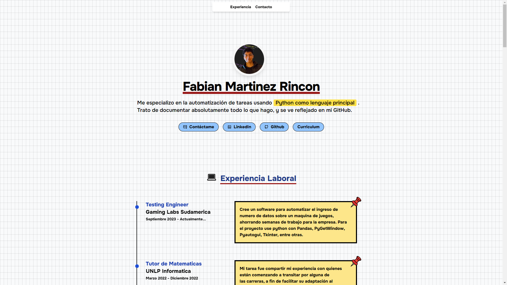

  
  
  

### 🐥 Primero Licenciatura en Sistemas

<a href="https://github.com/Fabian-Martinez-Rincon/CADP">
<a href="https://github.com/Fabian-Martinez-Rincon/Taller-de-Programacion">
<a href="https://github.com/Fabian-Martinez-Rincon/Arquitectura-de-Computadoras">
<a href="https://github.com/Fabian-Martinez-Rincon/Efficiency_X">
<a href="https://github.com/Fabian-Martinez-Rincon/Organizacion_de_Computadoras">
<a href="https://github.com/Fabian-Martinez-Rincon/Fabian-Martinez-Rincon.github.io">

### 🐔 Segundo Licenciatura en Sistemas

<a href="https://github.com/Fabian-Martinez-Rincon/Orientacion-a-Objetos1">
<a href="https://github.com/Fabian-Martinez-Rincon/AyED">
<a href="https://github.com/Fabian-Martinez-Rincon/FOD">
<a href="https://github.com/Fabian-Martinez-Rincon/Seminario-de-Lenguajes-Python">
<a href="https://github.com/Fabian-Martinez-Rincon/ISO">
<a href="https://github.com/Fabian-Martinez-Rincon/Ingenieria-de-Software1">

### 🦅 Tercero Licenciatura en Sistemas

<a href="https://github.com/Fabian-Martinez-Rincon/Programacion-Concurrente">
<a href="https://github.com/Fabian-Martinez-Rincon/Redes-y-Comunicaciones">
<a href="https://github.com/Fabian-Martinez-Rincon/CPLP">
<a href="https://github.com/Fabian-Martinez-Rincon/Proyecto-de-Software">
<a href="https://github.com/Fabian-Martinez-Rincon/Orientacion-a-Objetos-2">
<a href="https://github.com/Fabian-Martinez-Rincon/Ingenieria-de-Software2">

