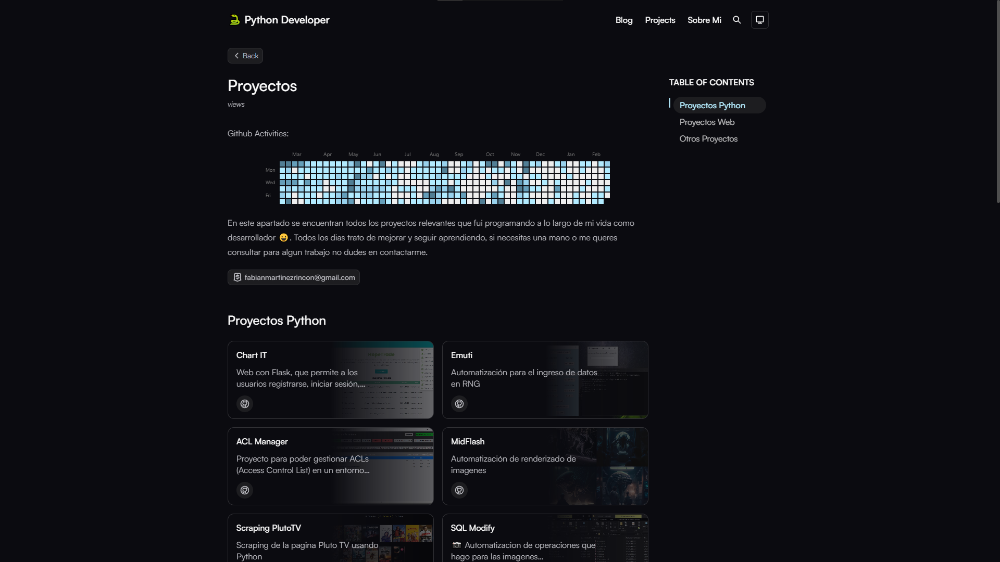
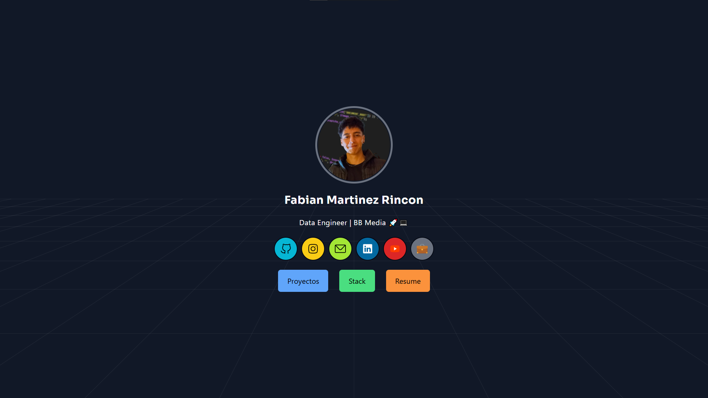

  
##  Primero | Analista Programador Universitario 

<a href="https://github.com/Fabian-Martinez-Rincon/Arquitectura-de-Computadoras">
<a href="https://github.com/Fabian-Martinez-Rincon/Organizacion_de_Computadoras">
<a href="https://github.com/Fabian-Martinez-Rincon/EI-Materias">
<a href="https://github.com/Fabian-Martinez-Rincon/Mega-Conversor-OC">

##   Segundo | Analista Programador Universitario 

##  Tercero | Analista Programador Universitario  

<table>
  <tbody>
    <tr>
      <td>
      
      </td>
      <td>
        
      </td>
        <td>
        
      </td>
    </tr>
    <tr>
      <td>Portfolio</td>
      <td>HomeLab</td>
      <td>Blog</td>
    </tr>
  </tbody>
</table>

##  Cuarto | Licenciatura en Sistemas 

##  Quinto | Licenciatura en Sistemas 

