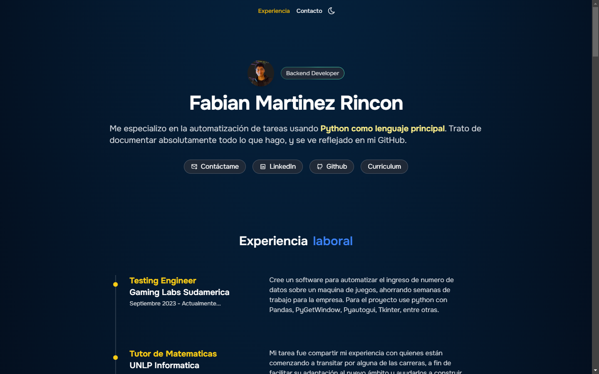

### 🐥 Primero Licenciatura en Sistemas 2021 

<a href="https://github.com/Fabo-University/Arquitectura-de-Computadoras">
<a href="https://github.com/Fabian-Martinez-Rincon/Efficiency_X">
<a href="https://github.com/Fabo-University/Organizacion_de_Computadoras">
<a href="https://github.com/Fabian-Martinez-Rincon/Fabian-Martinez-Rincon.github.io">

### 🐔 Segundo Licenciatura en Sistemas 2022 

### 🦅 Tercero Licenciatura en Sistemas 2023

### 🐉 Fixeando Tercero APU 2024

