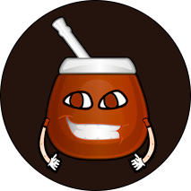

<h1 align="center"> <a href="https://fabian-martinez1.github.io/" target="_blank">Fabo</a> para los amigos ;)
 </h1>

<table align="right">
<tr>
<td>  
Mega Conversor OC
 </td> <td> 
El Materias
 </td>
</tr>

 <tr>
<td>  </td> <td> </td>
</tr>
 
</table>

<h3 align="center"> Un poco sobre mi  </h3>
 
El que no usa el titulo de técnico electrónico y actualmente estudia licenciatura en informática (UNLP). Mis intereses actuales se centran en terminar la carrera y no morir :D 

<h3 > Proyectos </h3>

<!--START_SECTION:top-followers-->

<!--END_SECTION:top-followers-->

 
